**Mtn Mesh Rail 1**  
  
Setup:  
1. Crosser Slot WR  
2. Streak Solo WR  
Reads:  
1. Streak  
2. Cheat Motion  
3. Crosser  
4. Drag  
5. Wheel  
  
  
  
  
#   
# MTN Mesh Rail 3  
  
[Menu](https://www.skool.com/codyballard/classroom/46d94d10?md=menu)[Next](https://www.skool.com/codyballard/classroom/46d94d10?md=ce9e68bc0c3b433f8b102da343ad90ec)  
  
Setup:  
1. Streak Solo WR  
2. Drag TE  
3. Crosser Slot WR  
4. Streak HB  
Reads:  
1. Seam Streak  
2. Cheat Motion  
3. Drag  
4. Crosser  
5. HB Streak  
  
  
# MTN PA Cross Switch 1  
5:27  
  
  
[Menu](https://www.skool.com/codyballard/classroom/46d94d10?md=menu)[Next](https://www.skool.com/codyballard/classroom/46d94d10?md=e9511f774c734dbc9f3ccc9287d6a377)  
  
Setup:  
1. Streak TE  
2. Slot Fade Slot WR  
3. Table HB  
Reads:  
1. Streak  
2. Slot Fade  
3. Flat  
4. Crosser  
5. Dig  
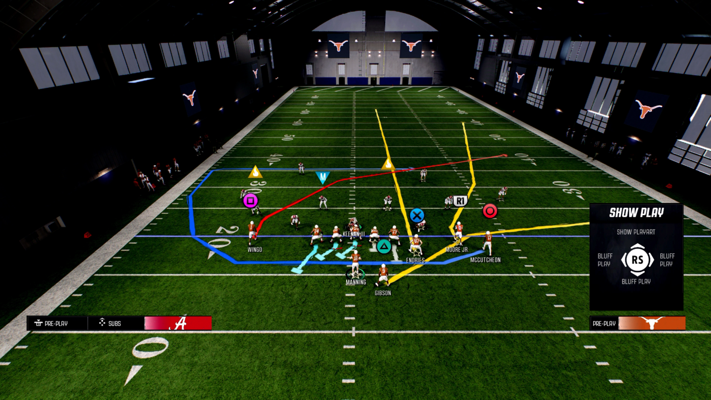  
  
  
  
  
# Smash Return 1  
  
  
  
[Menu](https://www.skool.com/codyballard/classroom/46d94d10?md=menu)[Next](https://www.skool.com/codyballard/classroom/46d94d10?md=64edf41f88b24de1aaf9a7e6847c4216)  
  
Setup:  
1. Streak Slot WR  
Reads:  
1. Seam Streak  
2. Drag  
3. Return  
4. Dig  
5. Flat  
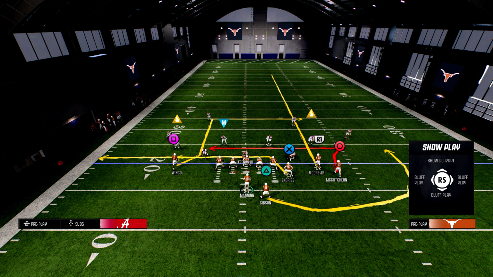  
  
# Smash Return 2  
  
[Menu](https://www.skool.com/codyballard/classroom/46d94d10?md=menu)[Next](https://www.skool.com/codyballard/classroom/46d94d10?md=b38ebfd300f74e96ba54914b3d61f7e5)  
  
Setup:  
1. Block HB  
2. Cross Slot WR  
3. Slot Fade Solo WR  
Reads:  
1. Drag  
2. Slot Fade  
3. Cross  
4. Return  
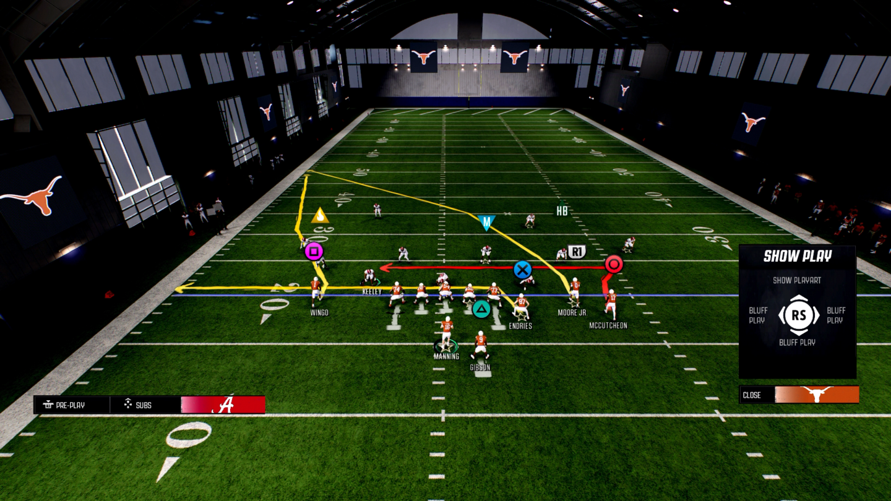  
  
# Smash Return 3  
  
[Menu](https://www.skool.com/codyballard/classroom/46d94d10?md=menu)[Next](https://www.skool.com/codyballard/classroom/46d94d10?md=265944537d6546738c2c4159c2bb6336)  
  
Setup:  
1. Streak Slot WR  
2. Drag TE  
3. Flat HB  
Reads:  
1. Drag  
2. Seam Streak  
3. Return  
4. Dig  
5. Flat  
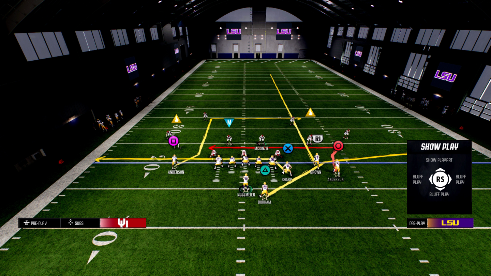  
  
**Flood 1**  
  
[Menu](https://www.skool.com/codyballard/classroom/46d94d10?md=menu)[Next](https://www.skool.com/codyballard/classroom/46d94d10?md=638f9f5a2b4d4d66a11f478275c3d9b1)  
  
Setup:  
1. Streak TE  
Reads:  
1. Seam Streak  
2. Corner  
3. Out  
4. Backside Dig  
  
  
  
# Flood 2  
  
[Menu](https://www.skool.com/codyballard/classroom/46d94d10?md=menu)[Next](https://www.skool.com/codyballard/classroom/46d94d10?md=4efa0bd472a440a4b68961203a40b75b)  
  
Setup:  
1. Drag Slot WR  
Reads:  
1. Out  
2. Zig  
3. Drag  
4. Dig  
  
  
# Flood 3  
  
[Menu](https://www.skool.com/codyballard/classroom/46d94d10?md=menu)[Next](https://www.skool.com/codyballard/classroom/46d94d10?md=143fa20578344103ae60338a326ad77d)  
  
Setup:  
1. Return Solo WR  
Reads:  
1. Out  
2. Zig  
3. Corner  
4. Return  
  
  
# MTN Mesh Rail RZ Combo  
  
  
  
[Menu](https://www.skool.com/codyballard/classroom/46d94d10?md=menu)[Next](https://www.skool.com/codyballard/classroom/46d94d10?md=d55514aa14bb4a03ba61e1934c9b7193)  
  
Setup:  
1. Curl Solo WR  
2. Speed Out Slot WR  
Reads:  
1. Cheat Wheel  
2. Curl  
3. Drag  
4. Out  
5. Wheel  
  
  
Cluster HB Strong Audibles:  
* Mtn Mesh  
* 45 Quick Base  
* Verticals  
* Mtn Mesh Post  
  
Trips TE Audibles:  
* QB Strong Power  
* RPO Alert Bubble  
* Verticals  
* China Y Post  
  
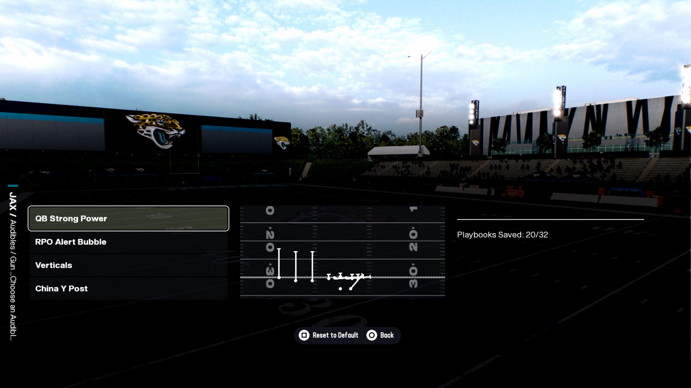  
  
Doubles Flex Y Off Close Audibles:  
* Mtn Dig Under  
* Y Sail  
* Flood H Post  
* PA Snag  
  
  
  
  
  
Off Trio Close Audibles:  
* Empty Mtn Flood H-Trail  
* 01 Trap  
* Mtn PA Cross Switch  
* Boomerang RPO Alert Swing  
  
  
  
  
[https://www.skool.com/codyballard/classroom/06f2c875?md=e7506774d515405abe92fd557af48d34](https://www.skool.com/codyballard/classroom/06f2c875?md=e7506774d515405abe92fd557af48d34)  
  
**Audibles/Hashmarks**  
  
  
  
[Menu](https://www.skool.com/codyballard/classroom/ad6d9313?md=menu)[Next](https://www.skool.com/codyballard/classroom/ad6d9313?md=4d02b63f30ec4fa7aa43ef6b52da517a)  
  
* Normal Y Off Close Audibles  
  
* Bunch X Nasty Audibles  
  
* Trips TE Flex Auidbles  
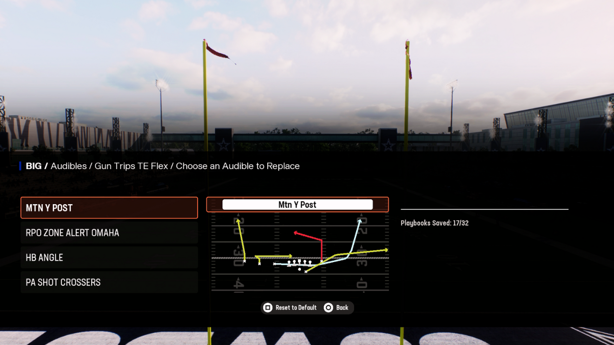  
* Slot Right Audibles  
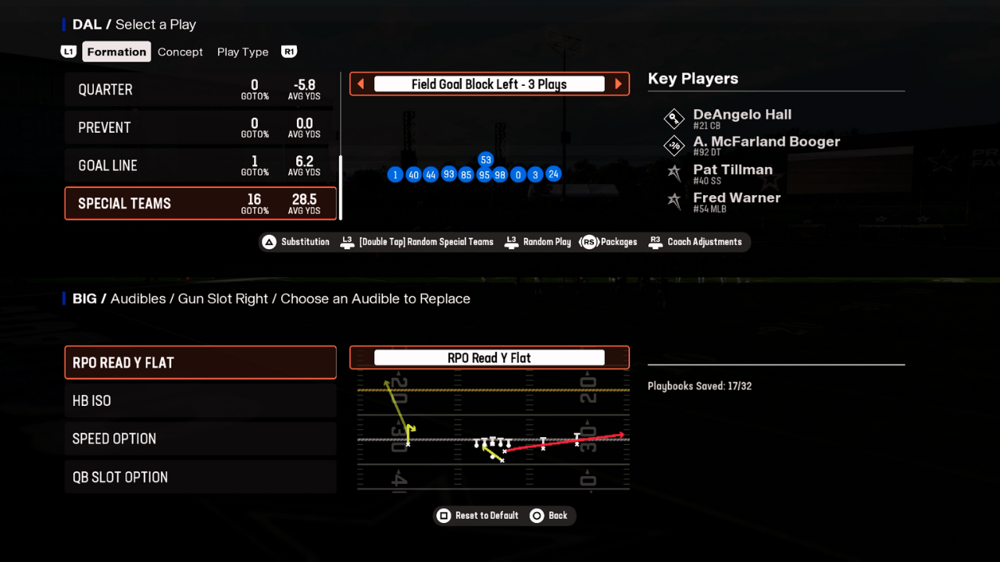  
  
** TRiPs TE  
  
**China Y Post 1**  
  
[Menu](https://www.skool.com/codyballard/classroom/f178fb40?md=menu)[Next](https://www.skool.com/codyballard/classroom/f178fb40?md=413fbe0a315a478388ba88ecadc30e91)  
  
Setup:  
1. Fade Outside Trips WR  
2. Return Middle Trips WR  
3. Slant Inside Trips WR  
4. Crosser TE  
Reads:  
1. Slant  
2. TE Crosser  
3. Cross Flat  
4. Return  
5. Fade  
  
  
**China Y Post 2**  
  
[Menu](https://www.skool.com/codyballard/classroom/f178fb40?md=menu)[Next](https://www.skool.com/codyballard/classroom/f178fb40?md=e27e2ae4e8d04a1085cc7142f385ffc6)  
  
Setup:  
1. Slant Inside Trips WR  
2. Flat Middle Trips WR  
3. Crosser TE  
4. Flat HB  
Reads:  
1. Slant  
2. Flat  
3. In  
4. Crosser  
5. In Late  
  
  
**Mtn Y Post 2**  
  
[Menu](https://www.skool.com/codyballard/classroom/ea438926?md=menu)[Next](https://www.skool.com/codyballard/classroom/ea438926?md=e70bc51872f4418bab189e238ff0482c)  
  
Setup:  
1. Slant Inside Trips WR  
2. Out Outside Trips WR  
Reads:  
1. Flat  
2. Slant  
3. Return  
4. Post  
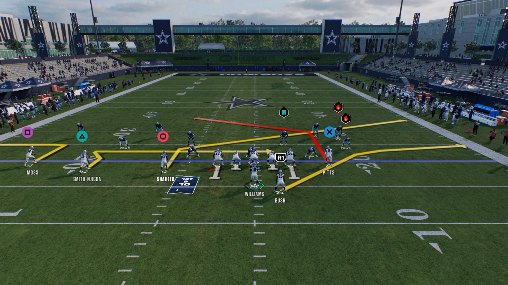  
  
**Y Option Wheel 3**  
  
[Menu](https://www.skool.com/codyballard/classroom/ea438926?md=menu)[Next](https://www.skool.com/codyballard/classroom/ea438926?md=d86fa268e5314a7a89a45a120ac6a5c5)  
  
Setup:  
1. Slant TE  
2. Return Middle Trips WR  
3. Swing HB To Solo WR Side  
Reads:  
1. Slant  
2. Return  
3. Post  
4. Fade  
  
  
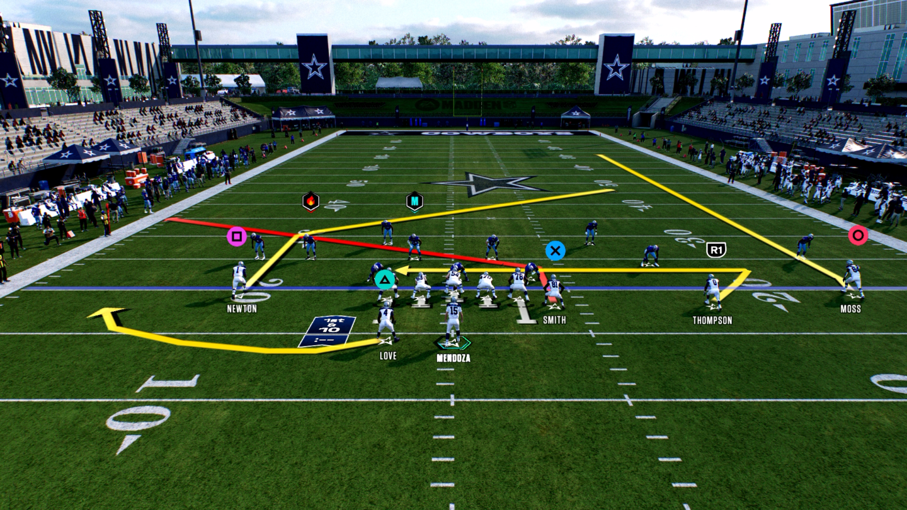  
**China Y Post 2**  
  
[Menu](https://www.skool.com/codyballard/classroom/f178fb40?md=menu)  
Setup:  
1. Flat Middle Trips WR  
2. In Outside Trips WR  
3. Slant Inside Trips WR  
4. Crosser TE  
5. Swing HB  
Reads:  
1. Flat  
2. In  
3. Slant  
4. Crosser  
5. In Late  
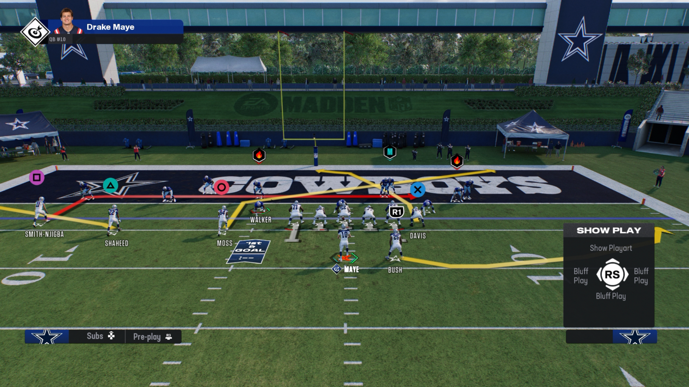  
## Levels Y Corner 1  
  
[Menu](https://www.skool.com/codyballard/classroom/18a898f0?md=menu)[Next](https://www.skool.com/codyballard/classroom/18a898f0?md=1cbaa76375d547d59cf886c6db1cc3c1)  
  
Setup:  
* Streak Inside Trips WR  
* Flat Middle Trips WR  
* Stem Outside Trips WR All The Way Down (Optional)  
Reads:  
* Seam Streak  
* Corner  
* Flat  
* In  
  
  
  
**WR Short Post - Power Play**  
  
4:54  
  
[Menu](https://www.skool.com/codyballard/classroom/fb306465?md=menu)[Next](https://www.skool.com/codyballard/classroom/fb306465?md=aa7e77b3cbe146449d19ad0d8928b8dc)  
  
Setup:  
1. Flat Middle Trips WR  
2. Zig Inside Trips WR  
3. Streak HB  
4. Flat TE  
Progression Reads  
1. Middle Trips WR  
2. Inside Trips WR  
3. HB Streak  
4. Outside Trips WR  
5. TE Flat  
  
## Drive Post 2  
  
  
  
[Menu](https://www.skool.com/codyballard/classroom/b5b84f14?md=menu)[Next](https://www.skool.com/codyballard/classroom/b5b84f14?md=4e40fbd8cf6c445a93f17226d336945f)  
  
Setup:  
1. Streak Middle Trips WR  
2. Corner Route Outside Trips WR  
3. Drag TE  
4. Wheel HB (Optional  
Progressions:  
1. Middle Trips WR Streak  
2. HB Wheel  
3. TE Drag  
4. Outside Trips Corner  
5. Inside Trips Post  
  
  
  
**Trips TE Pa Slot Corner RZ Combo 2**  
  
[Menu](https://www.skool.com/codyballard/classroom/ad6d9313?md=menu)[Next](https://www.skool.com/codyballard/classroom/ad6d9313?md=855efc97f9d14f31a1a8263ebaef6546)  
  
Setup:  
1. Speed Out Outside Trips WR  
2. Zig Inside Trips WR  
3. Flat Middle Trips WR  
4. Slant/Deep Cross TE  
5. Wheel HB  
6. Motion Snap Middle Trips WR To The TE Side And Snap When He Passes TE  
Reads:  
1. Speed Out  
2. Zig  
3. Slant  
4. Wheel  
5. Flat  
  
  
**Verticals 7**  
  
[Menu](https://www.skool.com/codyballard/classroom/ad6d9313?md=menu)[Next](https://www.skool.com/codyballard/classroom/ad6d9313?md=59a79e5bd2904ed38e72ebb7eb88b50d)  
  
Setup:  
1. Streak TE  
2. Streak Inside Trips WR  
3. Flat HB  
4. Drag Outside Trips WR  
5. Motion Snap Middle Trips WR To The TE Side after he passes TE  
Reads:  
1. Seam Streaks  
2. Fade  
3. Flat  
4. Drag  
  
  
  
  
**PA Counter Go 1**  
  
[Menu](https://www.skool.com/codyballard/classroom/4e732dca?md=menu)[Next](https://www.skool.com/codyballard/classroom/4e732dca?md=3712ae02fa8e451bab06d9bc00b6e968)  
  
Setup:  
* Slant Outside Trips WR  
* Streak TE  
* Block HB  
* Motion Outside Trips WR  
* Speed Out Middle Trips WR After Motion  
* Snap When Motioned WR Passes TE
  
*   
  
## PA Slot Corner 1  
  
[Menu](https://www.skool.com/codyballard/classroom/18a898f0?md=menu)[Next](https://www.skool.com/codyballard/classroom/18a898f0?md=44730c58ff2b4ac0bbe068c12e5a45e0)  
  
Setup:  
* Stem TE Corner All The Way Down  
* Streak Inside Trips WR  
* Slant Outside Trips WR  
* Block HB  
* Motion Outside Trips WR Across and Snap when he passes TE  
Reads:  
* Seam Streak  
* Corner  
* Post  
* Slant  
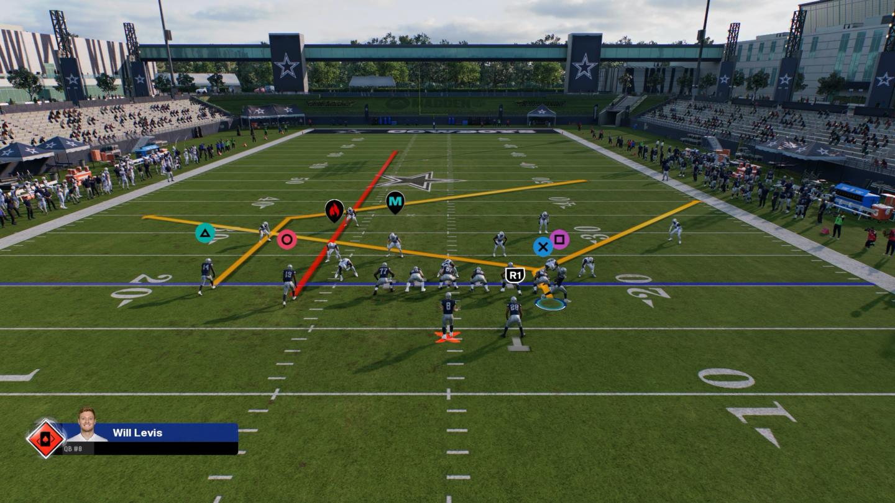  
  
  
## PA Slot Corner 1  
  
  
  
[Menu](https://www.skool.com/codyballard/classroom/27e026ef?md=menu)[Next](https://www.skool.com/codyballard/classroom/27e026ef?md=a649655e80634323a0cf8d5ac7e31255)  
  
Setup:  
* Curl Middle Trips WR  
* Stem All The Way Up  
* Stem Corner Route Down As Shown In Video  
* Speed Out Outside Trips WR  
* Curl TE  
* Block HB  
Reads:  
* Speed Out  
* Curl/Streak  
* Corner  
* TE Curl 
  
*   
*   
**China Y Post RZ Combo 1**  
  
[Menu](https://www.skool.com/codyballard/classroom/9a64d01a?md=menu)  
Setup:  
1. In Outside Trips WR  
2. Flat Middle Trips WR  
3. Slant Inside Trips WR  
4. Crosser TE  
5. Flat HB  
Reads:  
1. Flat  
2. In  
3. Slant  
4. Crosser  
5. In Late  
  
  
**China Y Post 2**  
  
[Menu](https://www.skool.com/codyballard/classroom/f178fb40?md=menu)  
Setup:  
1. Flat Middle Trips WR  
2. In Outside Trips WR  
3. Slant Inside Trips WR  
4. Crosser TE  
5. Swing HB  
Reads:  
1. Flat  
2. In  
3. Slant  
4. Crosser  
5. In Late  
  
  
**Trips TE Pa Slot Corner RZ Combo 2**  
  
[Menu](https://www.skool.com/codyballard/classroom/ad6d9313?md=menu)[Next](https://www.skool.com/codyballard/classroom/ad6d9313?md=855efc97f9d14f31a1a8263ebaef6546)  
  
Setup:  
1. Speed Out Outside Trips WR  
2. Zig Inside Trips WR  
3. Flat Middle Trips WR  
4. Slant/Deep Cross TE  
5. Wheel HB  
6. Motion Snap Middle Trips WR To The TE Side And Snap When He Passes TE  
Reads:  
1. Speed Out  
2. Zig  
3. Slant  
4. Wheel  
5. Flat  
  
  
## Trips TE - Drive Post 1  
  
[Menu](https://www.skool.com/codyballard/classroom/87614fdb?md=menu)[Next](https://www.skool.com/codyballard/classroom/87614fdb?md=e98b2771b52c4ea8877f87c1f62374d7)  
  
Setup:  
1. Flat Middle Trips WR  
2. Stem Inside Trips WR Down 1  
3. In Outside Trips WR  
4. In TE  
5. Stem Up Once  
Reads:  
1. Flat  
2. In  
3. Post  
4. Deep In  
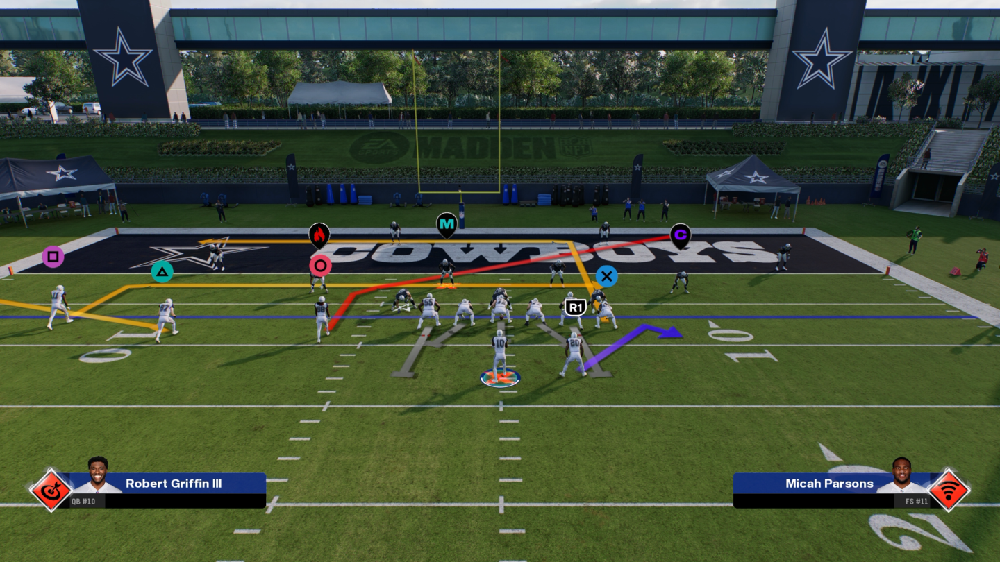  
  
**Shallow X Dig 1**  
  
[Menu](https://www.skool.com/codyballard/classroom/ea438926?md=menu)[Next](https://www.skool.com/codyballard/classroom/ea438926?md=e579cc99598742418dde8dff4b9d6735)  
  
Setup:  
1. Streak Inside Trips WR  
2. Drag Outside Trips WR  
3. Corner TE  
4. Swing HB  
Reads:  
1. Corner  
2. Streak  
3. Crosser  
4. Drag  
  
  
  
  
**3-3 Cub Coaching Adjustments/Packages/Subs/Shells**  
  
[Menu](https://www.skool.com/codyballard/classroom/99d5f510?md=menu)[Next](https://www.skool.com/codyballard/classroom/99d5f510?md=ed8603c304444cb2a64fbc4ee1f80bd5)  
  
Key Points:  
* Auto Flip On  
* Olb Flip Package  
* Lurk Artist Linebackers At OLB  
* Safeties on Close/Pinch  
* Shell - Cover 2  
  
  
[https://www.skool.com/codyballard/classroom/7e3e2ec0?md=c3118f9ab6124ad2b8f38465f0553458](https://www.skool.com/codyballard/classroom/7e3e2ec0?md=c3118f9ab6124ad2b8f38465f0553458)  
